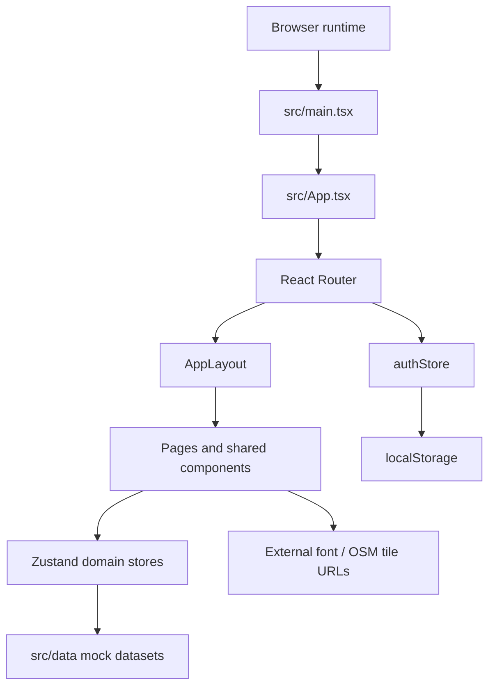
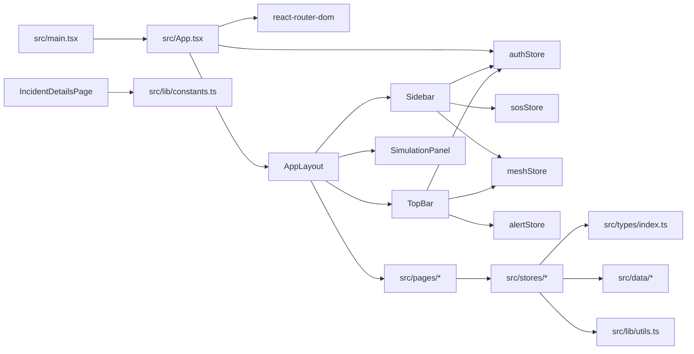
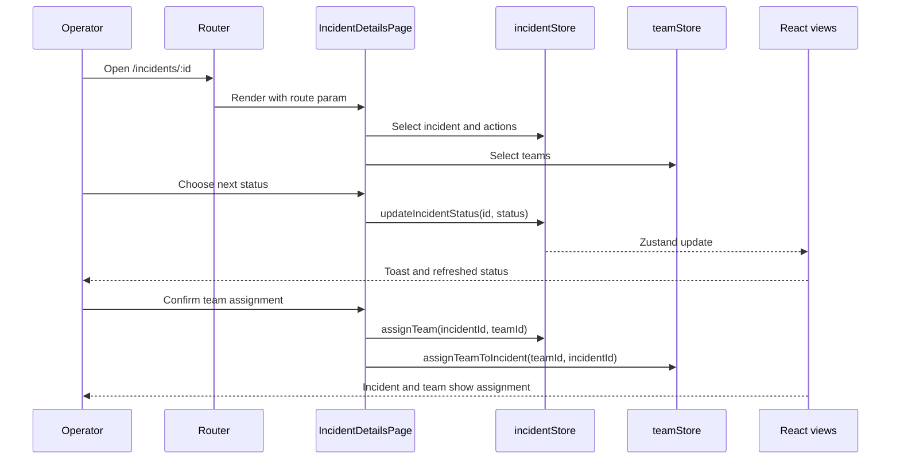
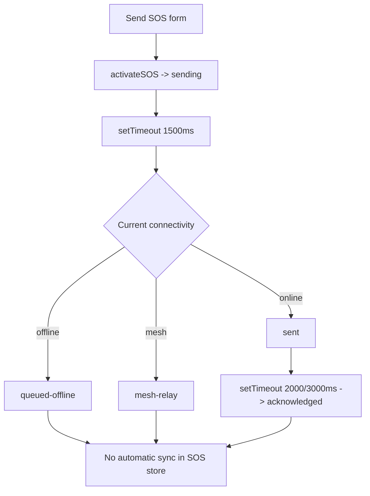
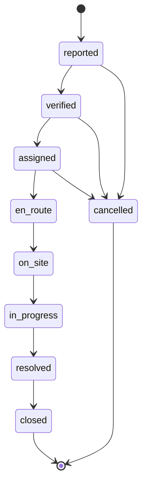

# ResQMesh Brain: Source-of-Truth Mental Model

> **Inspection baseline:** `main` at `cda5bea`, 2026-09-16. This describes the checked-in code, not the aspirational architecture in `project.md`.

## 1. System boundary

ResQMesh is a Vite-built React single-page application. The runtime boundary is the browser. There is no backend folder, API client, database, service worker, WebSocket, mesh adapter, model client, authentication provider, or test suite in the tracked repository.

## 2. Topology: heart, nerves, skin

| Layer | Files | Responsibility |
|---|---|---|
| **Heart: domain state and rules** | `src/stores/*.ts`, `src/types/index.ts`, `src/lib/constants.ts` | Holds incidents, teams, resources, alerts, messages, mesh labels/queue, SOS state, settings, and legal incident transitions. Rules are local functions passed to Zustand. |
| **Nerves: application wiring/interfaces** | `src/App.tsx`, `src/services/eventBus.ts`, `src/layouts/AppLayout.tsx` | Connects routing and layout; `eventBus` defines event names but is not a store bridge and has no observed consumers in the primary flow. |
| **Skin: user interface** | `src/pages`, `src/components`, `src/styles`, `src/data` | Presents dashboards, maps, charts, tables, modals, toasts, and simulation affordances over mock state. |
| **Build/runtime membrane** | `vite.config.ts`, `tsconfig.app.json`, `tailwind.config.js`, `package.json` | Provides Vite, TypeScript path alias `@/*`, Tailwind design tokens, and dependency graph. |

## 3. Module dependency graph

### State ownership

- `authStore`: selected user, authentication flag, profile patch, user status. Reads `mockUsers` and uses `localStorage` only for the selected user ID.
- `incidentStore`: incident list, selected incident, create/select/update/assign operations. Seeded from `mockIncidents`; resets on reload.
- `teamStore`: team status and incident association. Seeded from `mockTeams`; resets on reload.
- `resourceStore`: available/in-use counts and incident association. Seeded from `mockResources`; resets on reload.
- `alertStore`: alert list and unread count. Its mutators recalculate counts except `broadcastAlert`, which increments from the existing count.
- `communicationStore`: append-only in-memory chat messages.
- `reportStore`: reports and activity logs; report creation creates a log entry.
- `meshStore`: connectivity label, mesh nodes, sync queue, metrics. Queue items become `synced` immediately if mode is online, otherwise remain queued until an explicit caller invokes `processSyncQueue`.
- `sosStore`: one active SOS state machine. It has no collection of SOS events.
- `settingsStore`: app settings with `localStorage` persistence under `resqmesh_settings_v1`.
- `uiStore`: sidebar and simulation-panel visibility.

## 4. Primary execution trace: incident response

1. `src/main.tsx` obtains `#root`, imports global CSS, and renders `<StrictMode><App /></StrictMode>`.
2. `App` creates `ToastProvider`, `BrowserRouter`, and a `Suspense` boundary. Every page is lazy imported.
3. The root route redirects to `/dashboard`. The protected route checks only `useAuthStore(s => s.isAuthenticated)` and wraps `AppLayout`.
4. `AppLayout` composes persistent `Sidebar`, `TopBar`, the routed `Outlet`, and `SimulationPanel`.
5. `DashboardPage` selects incidents, teams, alerts, and current user. It calculates counts with array filters and renders links to incident details.
6. `IncidentDetailsPage` reads `id` from the URL and selects the incident from `incidentStore`. It derives `nextStatuses` from `STATUS_TRANSITIONS`.
7. A legal status action calls `updateIncidentStatus`, which maps the incident list and replaces one status. A toast is shown; no event is emitted and no activity log is created.
8. Assignment calls `incidentStore.assignTeam(incidentId, teamId)` and then `teamStore.assignTeamToIncident(teamId, incidentId)`. These are two independent state updates; they can diverge if one fails or if a user has stale state.
9. React subscribers re-render pages that select changed slices. The result exists only in the current browser memory, except settings/user selection where explicit local storage writes occur.

## 5. Logic flowcharts

### SOS state flow

The connectivity value is captured by the closure in `Sidebar.handleSOS` or `SimulationPanel.simulateSOS`; changing connectivity during the timer does not re-evaluate the decision.

### Incident lifecycle

The UI uses hyphenated strings (`en-route`, `on-site`, `in-progress`); Mermaid identifiers are normalized only for readability. `STATUS_TRANSITIONS` is the authoritative application rule.

### Simulation incident creation

`SimulationPanel.createHighPriority` creates a randomized `Flash Flood Warning` incident around Pune, then creates an alert linked to its new ID. It does not write a sync operation, report, event-bus message, team assignment, or server record.

## 6. Dependency graph and why each library exists

| Dependency | Role in this repository | Risk / note |
|---|---|---|
| `react`, `react-dom` | Component runtime and DOM rendering | React 19; no framework server layer |
| `react-router-dom` | Client-side routes, redirects, lazy page navigation | Browser history fallback must be configured by deployment |
| `zustand` | Lightweight local global state | No persistence middleware is used |
| `lucide-react` | Consistent UI icons | Presentation-only |
| `recharts` | Analytics and report charts | Large analytics bundle observed in build |
| `react-leaflet`, `leaflet` | Map page and markers | Depends on network tile access; no map auth layer |
| `clsx` | Conditional class composition via utility helpers | Small presentation helper |
| `vite`, `@vitejs/plugin-react` | Dev server and production bundling | `npm run build` is the current smoke test |
| `typescript` | Strict static checking | `noUnusedLocals` and `noUnusedParameters` are deliberately false |
| `tailwindcss`, `postcss`, `autoprefixer` | Utility styling and CSS processing | Tokens are in CSS/Tailwind config |
| `@types/react`, `@types/react-dom`, `@types/leaflet` | Type declarations | Development-only |

Notably absent despite the product specification: TanStack Query, React Hook Form, Zod, IndexedDB, a service worker/PWA plugin, API client, WebSocket client, CRDT library, Ed25519 library, test runner, and E2E runner.

## 7. Gotchas and non-obvious choices

1. **Authentication is effectively open by default.** `authStore` initializes `currentUser` to the first mock user and `isAuthenticated: true`, even when no local storage key exists. Treat this as demo convenience, not access control.
2. **Role-based navigation is narrow.** Only `responder` gets a different navigation array. `admin`, `control-room`, and `citizen` all use `adminNav`; route-level authorization is absent.
3. **The SOS is not an incident.** Activating SOS updates only `sosStore`; it does not create an incident or alert. Future work must define whether SOS is a source event, an incident projection, or both.
4. **The mesh queue is a label-level simulation.** `addToSyncQueue` sets `synced` based on current mode; `processSyncQueue` marks every item synced without applying payloads or checking connectivity. It is not a durable outbox.
5. **Assignment is split across stores.** Incident and team writes are separate. A future domain service should make the operation atomic and release prior team assignments.
6. **Status transitions are intentionally constrained.** Do not add arbitrary buttons that bypass `STATUS_TRANSITIONS`; status is the main workflow invariant.
7. **Dashboard timeline is hard-coded.** Its entries can describe actions not represented in state. Treat it as illustrative copy until it is driven by `reportStore.activityLogs`.
8. **Timers are not durable.** Reloading or changing modes during a timeout loses the intended delivery progression.
9. **Mock data is copied shallowly.** Store initialization uses array spreads; nested values are shared where present. If nested mutation is introduced, use immutable updates or deep cloning.
10. **External assets are runtime dependencies.** Fonts load from a CDN and maps need tile access; “no API key” is not “no network.”
11. **Build artifacts are generated, not source.** `dist/` may appear after build but is not the domain source of truth.
12. **Use aliases consistently.** Source imports assume `@/*` resolves to `src/*`, configured in both Vite and TypeScript.

## 8. Technical debt register

| Priority | Debt | Impact | First safe remedy |
|---|---|---|---|
| P0 | No real persistence, auth, authorization, or audit trail | Cannot support real emergency operations | Define backend contract and threat model before integration |
| P0 | Offline queue does not persist or reconcile | Data loss and false delivery claims | Implement durable outbox with idempotency, retries, conflicts, and observability |
| P0 | SOS does not enter incident/alert workflow | Control room may never see a citizen SOS | Define and implement a single SOS-to-incident projection |
| P1 | Assignment updates two stores independently | Inconsistent incident/team state | Add domain command/service and invariant tests |
| P1 | No tests or CI test script | Regressions can ship unnoticed | Add unit, component, and E2E smoke coverage |
| P1 | Claims in README/project.md exceed implementation | Agents and stakeholders may over-trust prototype | Keep docs synchronized; label simulation boundaries |
| P2 | Hard-coded dashboard timeline and seeded metrics | Misleading operational picture | Derive from activity log and measurable events |
| P2 | Large analytics/map chunks | Slower initial and route load | Analyze bundle and lazy-load heavy chart/map features further |
| P2 | No error boundary or central error reporting | Blank screens are hard to diagnose | Add route/app error boundaries and structured logging |

## 9. Cross-links

- Product meaning and documentation gaps: [`PRD.md`](./PRD.md)
- Binary implementation sequence: [`working_plan.md`](./working_plan.md)
- Instructions for future agents: [`prompt.md`](./prompt.md)
